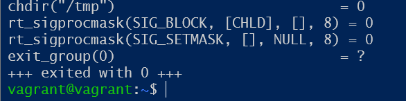
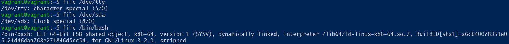
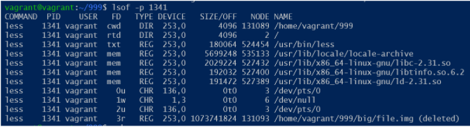
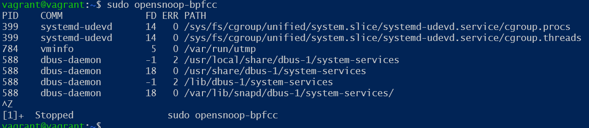
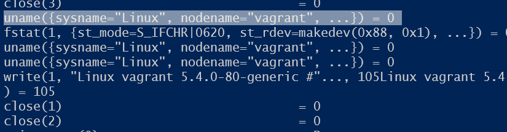
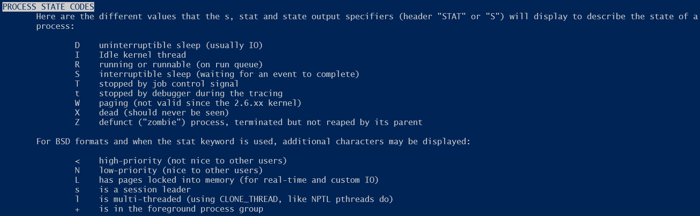

# Домашнее задание к занятию "3.3. Операционные системы, лекция 1"

1. Какой системный вызов делает команда `cd`? В прошлом ДЗ мы выяснили, что `cd` не является самостоятельной программой, это `shell builtin`, поэтому запустить `strace` непосредственно на `cd` не получится. Тем не менее, вы можете запустить `strace` на `/bin/bash -c 'cd /tmp'`. В этом случае вы увидите полный список системных вызовов, которые делает сам `bash` при старте. Вам нужно найти тот единственный, который относится именно к `cd`.
 chdir("/tmp")

Попробуйте использовать команду `file` на объекты разных типов на файловой системе. Например:
    ```bash
    vagrant@netology1:~$ file /dev/tty
    /dev/tty: character special (5/0)
    vagrant@netology1:~$ file /dev/sda
    /dev/sda: block special (8/0)
    vagrant@netology1:~$ file /bin/bash
    /bin/bash: ELF 64-bit LSB shared object, x86-64
    ```
 
    Используя `strace` выясните, где находится база данных `file` на основании которой она делает свои догадки.
 chdir("/tmp")
* **openat(AT_FDCWD, "/usr/share/misc/magic.mgc", O_RDONLY) = 3**
2. Предположим, приложение пишет лог в текстовый файл. Этот файл оказался удален (deleted в lsof), однако возможности сигналом сказать приложению переоткрыть файлы или просто перезапустить приложение – нет. Так как приложение продолжает писать в удаленный файл, место на диске постепенно заканчивается. Основываясь на знаниях о перенаправлении потоков предложите способ обнуления открытого удаленного файла (чтобы освободить место на файловой системе).


3. Занимают ли зомби-процессы какие-то ресурсы в ОС (CPU, RAM, IO)?
* Зомби не занимают памяти, но блокируют записи в таблице процессов, размер которой ограничен для каждого пользователя и системы в целом.**
5. В iovisor BCC есть утилита `opensnoop`:
    ```bash
    root@vagrant:~# dpkg -L bpfcc-tools | grep sbin/opensnoop
    /usr/sbin/opensnoop-bpfcc
    ```
    На какие файлы вы увидели вызовы группы `open` за первую секунду работы утилиты? Воспользуйтесь пакетом `bpfcc-tools` для Ubuntu 20.04. Дополнительные [сведения по установке](https://github.com/iovisor/bcc/blob/master/INSTALL.md).

6. Какой системный вызов использует `uname -a`? Приведите цитату из man по этому системному вызову, где описывается альтернативное местоположение в `/proc`, где можно узнать версию ядра и релиз ОС.

* Part of the utsname information is also accessible via /proc/sys/kernel/{ostype, hostname, osrelease, version, domainname}.

7. Чем отличается последовательность команд через `;` и через `&&` в bash? Например:
    ```bash
    root@netology1:~# test -d /tmp/some_dir; echo Hi
    Hi
    root@netology1:~# test -d /tmp/some_dir && echo Hi
    root@netology1:~#
    ```
* Команды, разделенные ; , выполняются последовательно независимо от их статуса завершения.
С && вторая команда выполняется только в том случае , если первая завершается успешно (возвращает статус выхода 0).

 Есть ли смысл использовать в bash `&&`, если применить `set -e`?
* При опции  -e будет выход, если команда завершается с ненулевым статусом. 
при использовании && и команды set -е, если команда set  завершится ошибкой выполнение команд прекратится.

8. Из каких опций состоит режим bash `set -euxo pipefail` и почему его хорошо было бы использовать в сценариях?
* -e скрипт немедленно завершит работу, если любая команда выйдет с ошибкой. По-умолчанию, игнорируются любые неудачи и сценарий продолжает выполняться. 
* -u Благодаря ему оболочка проверяет инициализацию переменных в скрипте. Если переменной не будет, скрипт немедленно завершиться.
* -x С помощью него bash печатает в стандартный вывод все команды перед их исполнением.
* -o pipefail  Bash возвращает только код ошибки последней команды в пайпе (конвейере)

Это позволит детализировать отчеты об ошибках. 

9. Используя `-o stat` для `ps`, определите, какой наиболее часто встречающийся статус у процессов в системе. В `man ps` ознакомьтесь (`/PROCESS STATE CODES`) что значат дополнительные к основной заглавной буквы статуса процессов. Его можно не учитывать при расчете (считать S, Ss или Ssl равнозначными).
* Sleeping - процессы ожидающие завершения.
* I - бездействующие процессы ядра.

* доп символы это доп характеристики, к примеру:  D    uninterruptible sleep (usually IO) (непрерывный сон)

 
 ---
## Как сдавать задания

Обязательными к выполнению являются задачи без указания звездочки. Их выполнение необходимо для получения зачета и диплома о профессиональной переподготовке.

Задачи со звездочкой (*) являются дополнительными задачами и/или задачами повышенной сложности. Они не являются обязательными к выполнению, но помогут вам глубже понять тему.

Домашнее задание выполните в файле readme.md в github репозитории. В личном кабинете отправьте на проверку ссылку на .md-файл в вашем репозитории.

Также вы можете выполнить задание в [Google Docs](https://docs.google.com/document/u/0/?tgif=d) и отправить в личном кабинете на проверку ссылку на ваш документ.
Название файла Google Docs должно содержать номер лекции и фамилию студента. Пример названия: "1.1. Введение в DevOps — Сусанна Алиева".

Если необходимо прикрепить дополнительные ссылки, просто добавьте их в свой Google Docs.

Перед тем как выслать ссылку, убедитесь, что ее содержимое не является приватным (открыто на комментирование всем, у кого есть ссылка), иначе преподаватель не сможет проверить работу. Чтобы это проверить, откройте ссылку в браузере в режиме инкогнито.

[Как предоставить доступ к файлам и папкам на Google Диске](https://support.google.com/docs/answer/2494822?hl=ru&co=GENIE.Platform%3DDesktop)

[Как запустить chrome в режиме инкогнито ](https://support.google.com/chrome/answer/95464?co=GENIE.Platform%3DDesktop&hl=ru)

[Как запустить  Safari в режиме инкогнито ](https://support.apple.com/ru-ru/guide/safari/ibrw1069/mac)

Любые вопросы по решению задач задавайте в чате Slack.

---
