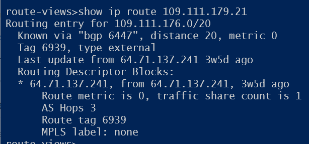
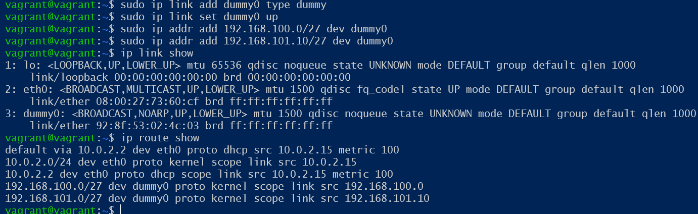
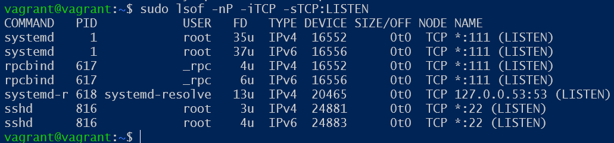
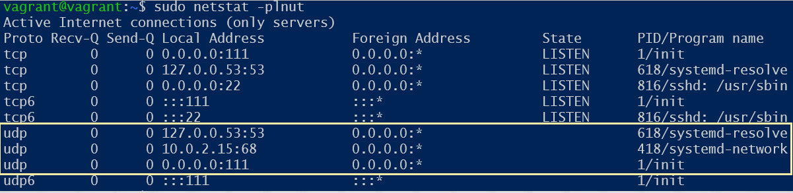
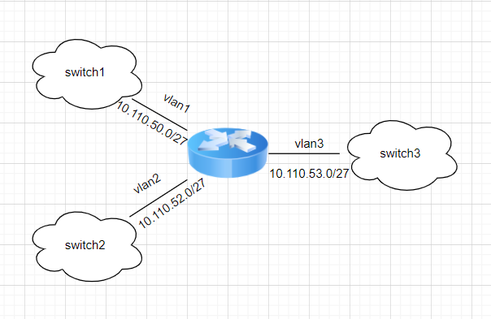

Домашнее задание к занятию "3.8. Компьютерные сети, лекция 3"

1. Подключитесь к публичному маршрутизатору в интернет. Найдите маршрут к вашему публичному IP.

telnet route-views.routeviews.org

Username: rviews

show ip route x.x.x.x/32

show bgp x.x.x.x/32

2. Создайте dummy0 интерфейс в Ubuntu. Добавьте несколько статических маршрутов. Проверьте таблицу маршрутизации.

3. Проверьте открытые TCP порты в Ubuntu, какие протоколы и приложения используют эти порты? Приведите несколько примеров.

* 22/tcp    ssh- SSH (англ. Secure Shell — «безопасная оболочка») — сетевой протокол прикладного уровня, позволяющий производить удалённое управление операционной системой и туннелирование TCP-соединений (например, для передачи файлов).
* 111/tcp open  rpcbind - Предоставляет информацию между системами на основе Unix. Порт часто проверяется, его можно использовать для снятия отпечатков пальцев ОС Nix и получения информации о доступных сервисах. Порт, используемый с NFS, NIS или любой службой на основе rpc.

4. Проверьте используемые UDP сокеты в Ubuntu, какие протоколы и приложения используют эти порты?

* 53/TCP,UDP DNS (Domain Name System)
* 68 bootpc Клиенты BOOTP; также используется клиентами DHCP 
* 111 sunrpc Протокол удалённого вызова процедур (Remote Procedure Call, RPC) для удалённого запуска команд, используется сетевой файловой системой (Network Filesystem, NFS)

5. Используя diagrams.net, создайте L3 диаграмму вашей домашней сети или любой другой сети, с которой вы работали.

Задание для самостоятельной отработки (необязательно к выполнению)

6*. Установите Nginx, настройте в режиме балансировщика TCP или UDP.

7*. Установите bird2, настройте динамический протокол маршрутизации RIP.

8*. Установите Netbox, создайте несколько IP префиксов, используя curl проверьте работу API.
